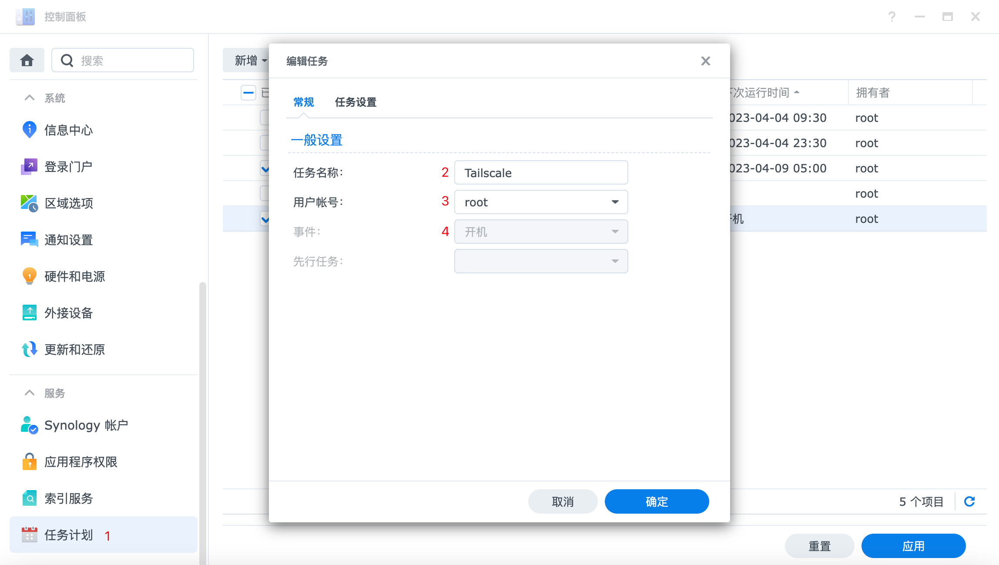
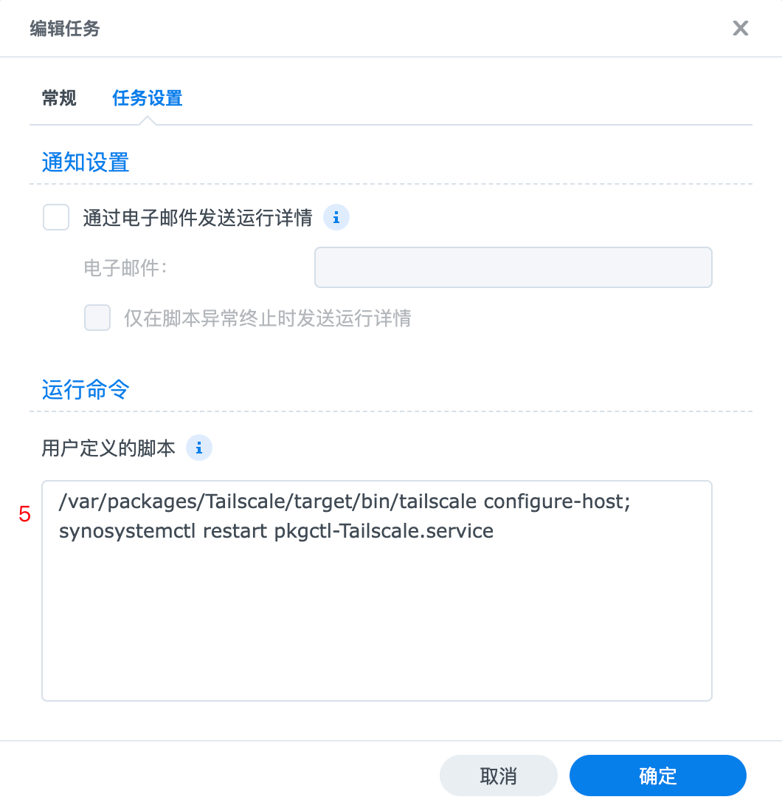
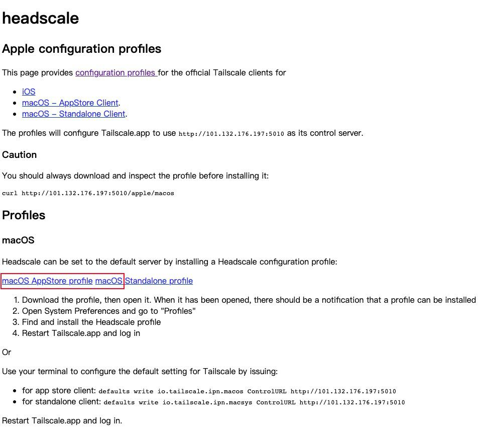
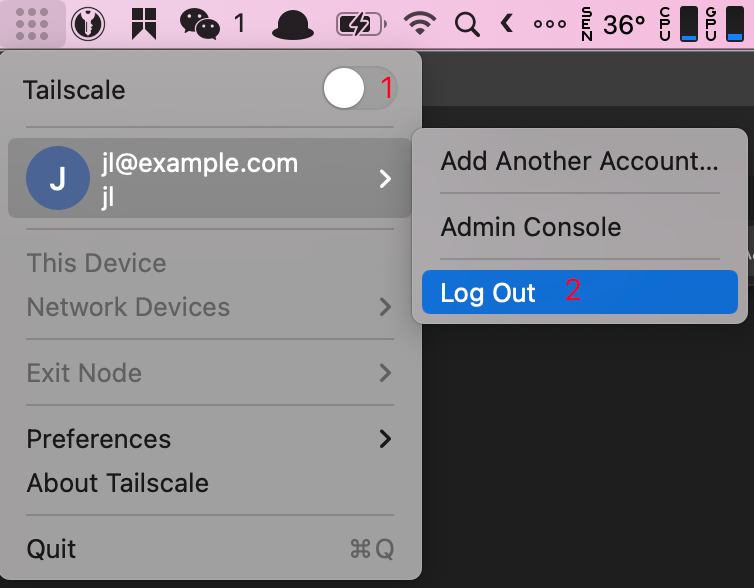

# headscale-deploy

headscale 一键部署，Ubuntu20.04LTS 环境

参考\
<https://github.com/juanfont/headscale>\
<https://icloudnative.io/posts/how-to-set-up-or-migrate-headscale/#headscale-%E9%83%A8%E7%BD%B2>

```bash
# 执行命令，按提示执行即可
./deploy.sh
```

## 1.防火墙开放端口

- headscale
TCP:5010
- ip_depr
TCP:8443,UDP:3478
- headscale-webui
TCP:5000

## 2.headscale

### 2.1 修改配置文件

- server_url
改为公网 IP 或域名
- listen_addr: 0.0.0.0:5010
改为监听所有 IPV4 的端口
- ip_prefixes
自定义私有网段，也可同时开启 IPv4 和 IPv6，建议开启 IPv6，有更大几率直接 IPv6 直连
- magic_dns
如果暂时用不到 DNS 功能，可以先将 magic_dns 设为 false。

### 2.2 查看状态

```bash
$ docker exec headscale headscale user create jl
# 通过 Pre-Authkeys 接入，生成一个一小时的 pre-authkey 的 token
$ docker exec headscale headscale preauthkeys create -e 10h -u jl
729fabe383247345c22f970af43219eb8aa500cc632f89eb
```

### 2.3 常用命令

- headscale

```bash
# docker 的话命令前加 docker exec headscale
# 查看命名空间
headscale user list
# 创建命名空间 default
headscale user create default
# 销毁命名空间 default
headscale user destroy default
# 查看所有节点
headscale nodes list
# 查看命名空间 default 下的节点
headscale -n default nodes list
# 删除节点 ID 为 2 的节点
headscale nodes delete -i 2
# 重命名 node 名称
headscale node rename newname -i 2
# 查看已经生成的 key
headscale -n default preauthkeys list
```

- tailscale

```bash
# 在 Tailscale 客户端上使用以下命令查看目前可以使用的 DERP 服务器
$ tailscale netcheck
Report:
        * UDP: true
        * IPv4: yes, 117.143.3.251:1600
        * IPv6: no, but OS has support
        * MappingVariesByDestIP: false
        * HairPinning: false
        * PortMapping: 
        * CaptivePortal: false
        * Nearest DERP: Seattle
        * DERP latency:
                - sea: 194.6ms (Seattle)
                - sfo: 198.3ms (San Francisco)
                - lax: 199.6ms (Los Angeles)
                - syd: 203.1ms (Sydney)
                - tok: 209.6ms (Tokyo)
                - den: 221.1ms (Denver)
                - ord: 227.6ms (Chicago)
                - dfw: 229.5ms (Dallas)
                - hkg: 241.6ms (Hong Kong)
                - tor: 245.5ms (Toronto)
                - hnl: 248.9ms (Honolulu)
                - mia: 249.4ms (Miami)
                - nyc: 250.6ms (New York City)
                - sin: 262.4ms (Singapore)
                - lhr: 351.8ms (London)
                - sao: 354.2ms (São Paulo)
                - par: 359.7ms (Paris)
                - waw: 366.2ms (Warsaw)
                - ams: 369.7ms (Amsterdam)
                - fra: 371.3ms (Frankfurt)
                - mad: 382ms   (Madrid)
                - blr: 389.7ms (Bangalore)
                - dbi: 469.5ms (Dubai)
                - jnb: 514.7ms (Johannesburg)
# 查看与通信对端的连接方式，看到只 b0be835b5c26 是通过 DERP 服务器来中继流量的
$ tailscale status
fd7a:115c:a1e0::2 synologyds918        jl           linux   -
fd7a:115c:a1e0::3 b0be835b5c26         jl           macOS   active; relay "tok", tx 13840472 rx 1633492
fd7a:115c:a1e0::1 jldemac-pro          jl           macOS   offline
# 使用 Tailscale 命令行工具来测试
$ tailscale ping 10.6.8.3
pong from b0be835b5c26 (fd7a:115c:a1e0::3) via 101.82.215.60:19852 in 63ms
# mac
/Applications/Tailscale.app/Contents/MacOS/Tailscale status
```

## 3.headscale-webui

### 3.1 bug 修复

参考：
https://github.com/iFargle/headscale-webui/pull/127
https://github.com/l00ps/headscale-webui/commit/8a7dc9b91a155ca6651c6a39a3efb0106a75c0e0

```bash
# 容器启动后进入容器交互
docker exec -u app -it headscale-webui /bin/sh
# 修改文件
cd /app
vi headscale.py
# 将 "machines" 修改为 "nodes"，'machines' 修改为 'nodes'，"machine" 改为 "node"，'machine' 改为 'node'，lastSuccessfulUpdate 改为 lastSeen
vi renderer.py
cd /app/static/js
# 将 response.machine 修改为 response.node
vi custom.js
exit
# 重启容器即可
```

### 3.2 连接 headscale

```bash
# 创建 API Key，(e.g. 30m, 24h) (default "90d")
docker exec headscale headscale apikeys create
```

<http://192.168.10.60:5000/>\
根据提示填写 docker-compose.yml 填写的用户名密码，填写 API Key 并保存

### 3.3 免费 IP 证书

<https://zerossl.com/>\
为了验证证书，需要将 nginx 的 80 端口暂时开放

- https 配置，

```conf
server {
    listen             443 ssl;
    server_name  192.168.10.60;
    ssl_prefer_server_ciphers on;
    ssl_certificate      cert/192.168.10.60.crt;
    ssl_certificate_key  cert/192.168.10.60.key;

    location     / {
      root         html;
      index        index.html;
    }

    location /headscaleui/ {
        proxy_redirect off;
        proxy_set_header Host $host;
        proxy_set_header X-Real-IP $remote_addr;
        proxy_set_header X-Forwarded-For $proxy_add_x_forwarded_for;
        proxy_pass http://127.0.0.1:5000/;
    }

}
```

<https://192.168.10.60/headscaleui/>

## 4.打通局域网

```bash
# 群辉客户端修改注册节点的命令，在原来命令的基础上加上参数 --advertise-routes=192.168.10.0/24，告诉 Headscale 服务器“我这个节点可以转发这些地址的路由”。如果有多条路由则用英文逗号隔开。
$ tailscale up --login-server=http://192.168.10.60:5010 --accept-dns=false --advertise-routes=192.168.10.0/24 --reset
# 查看群辉所在的节点 ID 为 2 的节点是否开启路由
$ headscale routes list -i 2
Route           | Enabled
192.168.10.0/24 | true
# 显示 true 则否开启，否则以下命令开启路由
$ headscale routes enable -r 2
```

## 5.Exit Node

Exit Node功能允许您通过网络上的特定设备路由所有非 Tailscale 互联网流量，这台特定的路由设备称为 Exit Node。
<https://blog.csdn.net/wbsu2004/article/details/127915684>

## 6.客户端接入

### 6.1 Synology

1. 下载安装 tailscale 客户端
<https://pkgs.tailscale.com/stable/#spks>
2. 在 Synology 的终端 root 权限下通过 pre-authkey 的 token 加入

    ```bash
    tailscale up --login-server=http://192.168.10.60:5010 --accept-dns=false --authkey 729fabe383247345c22f970af43219eb8aa500cc632f89eb
    ```

3. 配置Synology以启用出站连接\
<https://tailscale.com/kb/1131/synology/>



    ```bash
    /var/packages/Tailscale/target/bin/tailscale configure-host
    synosystemctl restart pkgctl-Tailscale.service
    ```

### 6.2 mac

1. 美区商店下载 Tailscale
2. 修改控制服务器
浏览器访问：<http://192.168.10.60:5010/apple>

点击下载描述文件并安装
3. 打开 Tailscale 点击 Log in... 会跳转到浏览器
4. 复制浏览器的命令并修改 NAMESPACE 后在服务器执行
5. 删除多余账号


### 6.3 linux

```bash
wget https://pkgs.tailscale.com/stable/tailscale_1.34.1_amd64.tgz
tar zxvf tailscale_1.34.1_amd64.tgz
cp tailscale_1.34.1_amd64/tailscaled /usr/sbin/tailscaled
cp tailscale_1.34.1_amd64/tailscale /usr/bin/tailscale
cp tailscale_1.34.1_amd64/systemd/tailscaled.service /lib/systemd/system/tailscaled.service
cp tailscale_1.34.1_amd64/systemd/tailscaled.defaults /etc/default/tailscaled
systemctl enable --now tailscaled
# 将 <HEADSCALE_PUB_IP> 换成你的 Headscale 公网 IP 或域名
tailscale up --login-server=http://192.168.10.60:5110 --accept-routes=true --accept-dns=false --authkey 729fabe383247345c22f970af43219eb8aa500cc632f89eb
```

### 6.4 ios

1. tailscale 退出登录
2. 在设置中找到 tailscale，如果以前登陆过则打开 "Reset Keychain switch" 开关，在 "Alternate Coordination Server URL" 中填入 "http://192.168.10.60:5010"
3. 在iOS应用程序切换器中关闭应用程序重新启动应用程序，根据提示会跳转到新的页面
4. 将页面中出现的命令在 headscale 服务器执行，这时应该页面会自动关闭并登录，如果没有，多试几遍

### 6.5 Windows

<https://github.com/juanfont/headscale/blob/main/docs/windows-client.md>

## 7.clash与tailscale的兼容问题

<https://github.com/Dreamacro/clash/issues/2251>

## 8.解决开启 headscale 后网速慢的问题

config.yaml 修改 dns，即不使用 headscale 的 dns

- 默认配置

```yaml
dns_config:
  # Whether to prefer using Headscale provided DNS or use local.
  override_local_dns: true

  # List of DNS servers to expose to clients.
  nameservers:
    - 1.1.1.1
```

- 修改后的配置

```yaml
dns_config:
  # Whether to prefer using Headscale provided DNS or use local.
  override_local_dns: false

  # List of DNS servers to expose to clients.
  nameservers: []
    # - 1.1.1.1
```

## 9.定时重启容器（可选）

```bash
$ crontab -e
0 4 * * * docker-compose -f /opt/headscale/docker-compose.yml restart
```
